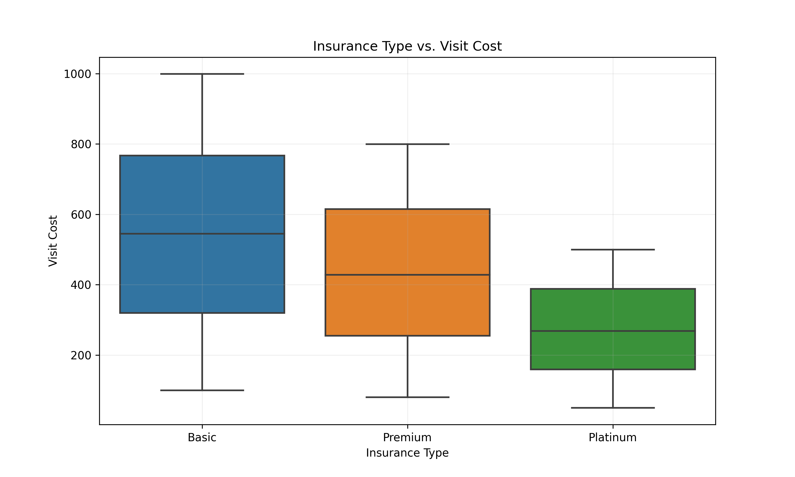

# DATASCI 217 Final Exam
## Samantha Chan

## Question 1: Data Preparation with Command-Line Tools
To clean and prepare the data, I first ran `generate_dirty_data.py` to generate the csv file. 
Using the `grep` and `sed` commands, I removed the empty lines, comments, and extra comments. 
In order to select certain columns for our clean csv file, I used the `cut` command. Next, I 
create the `insurance.lst` file. Using `echo` I listed variables for the new variable. Finally, 
using the `head` command, I printed the first few rows, and the total number of visits.

## Question 2: Data Analysis with Python
In `analyze_visits.py`, I first loaded the csv file and cleaned the data. I then randomly
generated insurance information, using a dictionary to account for price differences in each
insurance type. Finally to find the summary statistics, I used aggregation and output the
information for each.

## Question 3: Statistical Analysis
### Analyze Walking Speed
For the multiple regression for walking speed, the model has an R-squared of 0.801, which indicates that approximately 80.1% of the variance in walking speed is explained by the predictors. We can also see that education level significantly affects walking speed, which is illustrated by the coefficients in the table below. High school is associated with a decrease in walking speed by 0.7876, while graduate school is associated with an increase in walking speed by 0.4032. In addition age has a significantly negative coefficient of -0.0302, which indicates that wlaking speed decreases as age increases. 

| Variable           | Coefficient  |
| ------------------ | ------------ |
| Graduate School    | 0.4032       |
| High School        | -0.7876      |
| Some College       | -0.3985      |
| Age                | -0.0302      |

Based on the ANOVA results, eduacation level and age are highly significant with a p-value less than 0.05. When running our analysis, we found that there were three outliers. To refine our model, we removed these outliers, making our results more accurate and representative of our population. Overall, yes, education level affects walking speed with graduate school being associated with highest speed and high school associated with lowest speed. Age also influences walking speed because as age increases, walking speed decreases. 

### Analyze Costs
To analyze the effect of insurance type on cost, we found the mean and standard deviation for each insurance tier, which is illustrated in the table below. 

| Insurance Type | Mean         | Standard Deviation |
| -------------- | ------------ | -------------------|
| Basic          | 550.045      | 260.782            |
| Premium        | 436.521      | 205.981            |
| Platinum       | 271.583      | 130.593            |

As we can see, as we move up in insurance type tiers, the mean cost of a visit decreases. In addition, we can see in the box plot that there is a decreasing trend in price as the insurance type tiers go up. 

These results are significant as tested using the ANOVA statistical test. Our F-statistic of 2365.15 illustrates that the high variability in visit costs is more strongly influenced by the difference in isurance types rather than by random variation within groups. In addition our p-value of 0.000 is less than alpha (0.05), which means that differences between insurance types is statistically significant.

To calculate the effect size, we calculated the between-group sum of squares and divded it by the total sum of squares. Our resulting eta squared is 0.23. This indicates a large effect size meaning that insurance type explains a substantial portion of the variance in cost of visits. 

### Advanced Analysis
For our analysis on education age effects on walking speed, we fitted an ols model to our data. To control confounders, we used the formula `walking_speed ~ age * education_level + insurance_type`. From our regression results illustrated below in the table, we can see that education and age effect walking speed. Graduate student level of education is associated with a postiive effect on walking speed with a coefficient of 0.3866, while high school and some college levels of education have a negative effect of walking speed with coefficients of -0.8226 and -0.4144 respectively. In addition, the p-values are less than 0.001, which make these effects statistically significant. For age, the coefficient is -0.0305, which means there is a slight negative association to walking speed. Since p < 0.001, this is significant. 
We also tested to determine if the interactions between age and education levels were statistically significant. However, the coefficients were similar to each other showing that the relationship between age and walking speed does not vary significantly across education levels. Also, because all of the p-values are greater than alpha, these results are not significant. 

| Variable               | Coefficient | P-value |
| ---------------------- | ----------- | ------- |
| Graduate               |  0.3866     | 0.000   |
| High School            | -0.8226     | 0.000   |
| Some College           | -0.4144     | 0.000   |
| Platinum               | -0.0121     | 0.071   |
| Premium                | -0.0093     | 0.162   |
| Age                    | -0.0305     | 0.000   |
| Age:Graduate           | 0.0003      | 0.485   |
| Age:High School        | 0.0007      | 0.100   |
| Age:Some College       | 0.0003      | 0.459   |

## Part 4: Data Visualization
For visualizations, I used the seaborn package to plot different types of plots to analyze walking speed, cost analysis, and combined visualizations. 

The scatter plot above illustrates how as age increases, the walking speed decreases.

This boxplot illustrates the effect of education level on walking speed. As we can see, graduate students have the highest average walking speed, while high schoolers have the lowest average walking speed.

This lineplot shows the interaction of education and age. As age increaes, the walking speed decreases. In addition, it can be seen that graduate students and bachelors education levels have overall higher walking speeds compared to high school and some college level educations.

The barplot shows that the average cost per visit for the basic insurance type has the highest cost. The platinum insurance type has the lowest visit cost. 

This boxplot also illustrates the insurance type compared to the cost of a visit. The basic plan has the largest range of prices per visit cost. The platinum plan has the smallest range of prices, along with the lowest median visit cost.

This pair plot compares age, walking speed, and visit cost. We can see that there is a negative trend comparing age and walking speed. The plot also shows that lower tier insurance plans have lower costs and high tier insurance plans have higher costs.

This multiple facet grid shows that regardless of education level, as age increases, the speed of walking decreases.
